# Active Directory Home Lab

A virtualised Windows Server 2022 + Windows 10
Active Directory environment built for IT support
skills development and portfolio demonstration.

## Environment
- Host: Windows 11, 16GB RAM, VirtualBox 7.x
- DC01: Windows Server 2022 Evaluation (192.168.1.1)
- WORKSTATION01: Windows 10 Pro (192.168.1.10)
- Domain: helpdesk.local

## What was configured
- Active Directory Domain Services installed
- Forest and domain created (helpdesk.local)
- Organisational Units: _USERS, _COMPUTERS, _GROUPS, _ADMINS
- 5 domain user accounts created and managed
- Security group (IT-Support-Staff) with members
- Windows 10 workstation joined to domain
- Group Policy Object (Lock Screen Policy) applied to _USERS OU

## AD Tasks performed
1. Password reset
2. Account lockout and unlock
3. Account disable/enable
4. New user provisioning
5. OU management (move user between OUs)
6. Group Policy creation and application
7. Last logon audit
8. Computer account management
9. PowerShell AD query (Get-ADUser)
10. Loom video walkthrough

## Walkthrough video

https://github.com/user-attachments/assets/d914bb13-f3b8-45f1-a499-da2d5456ae1c

## Screenshots
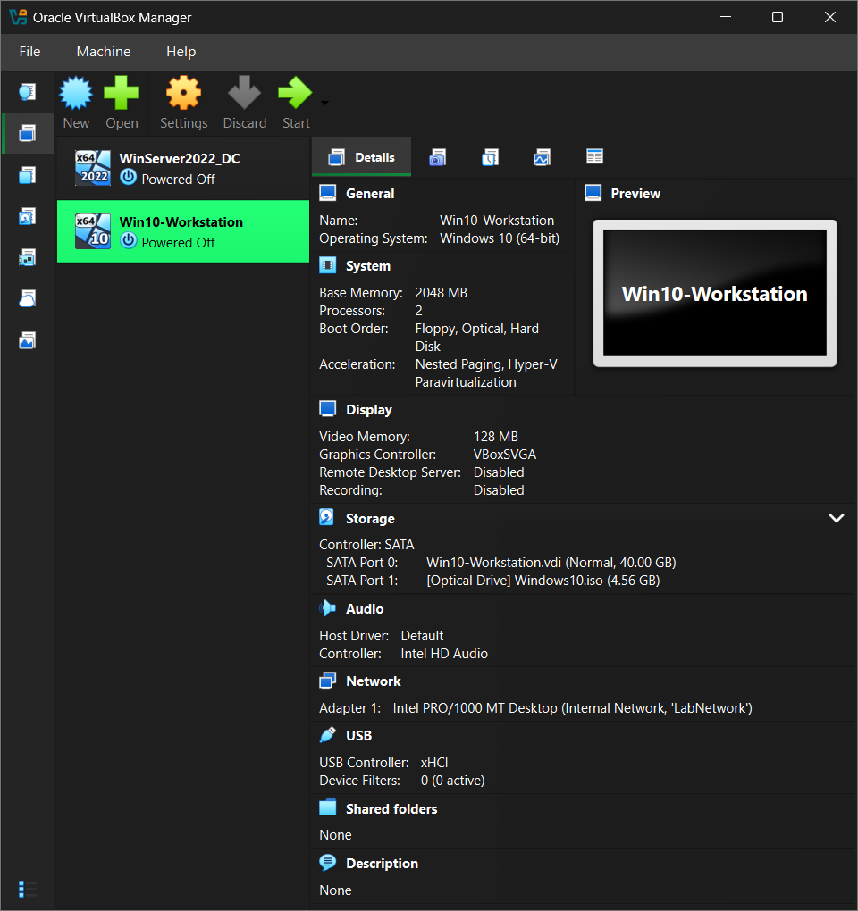
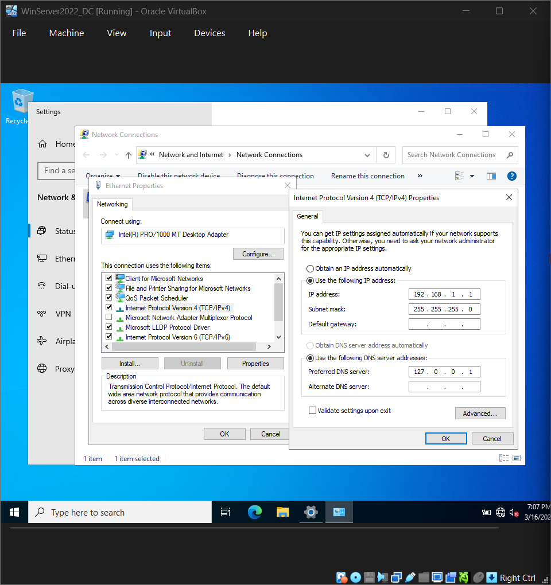
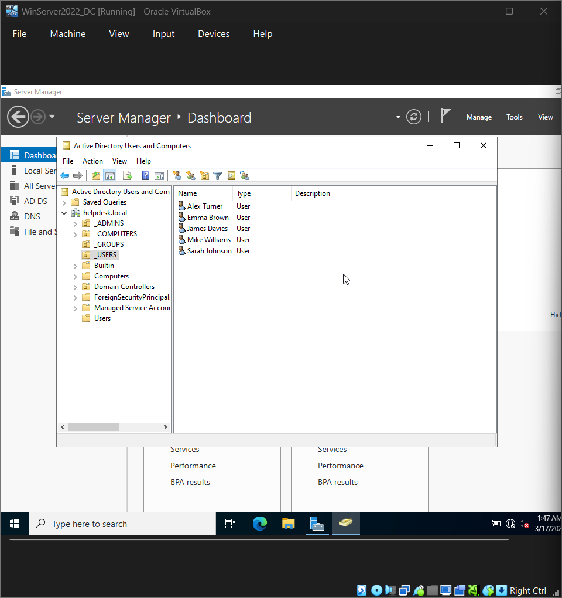
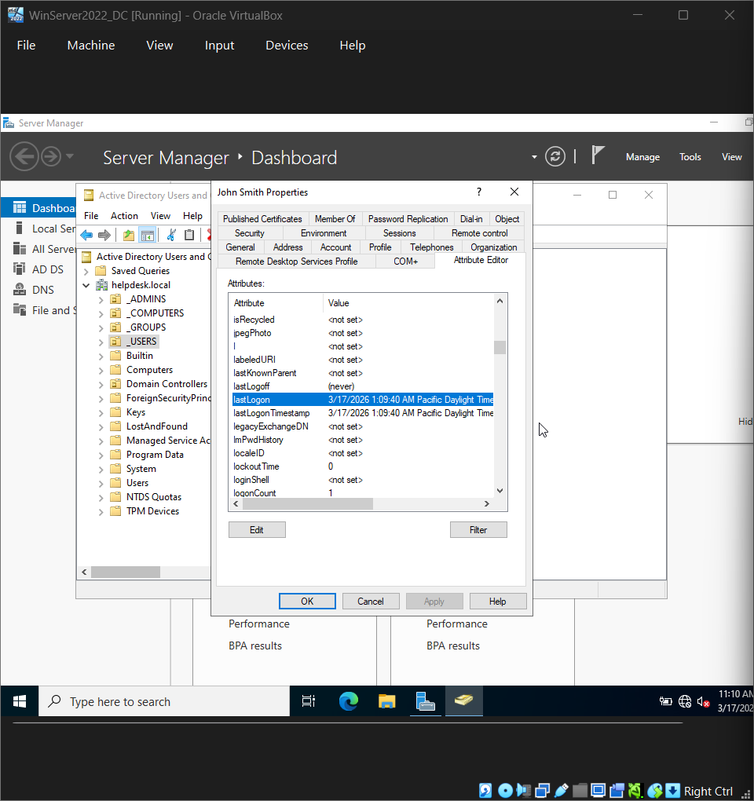
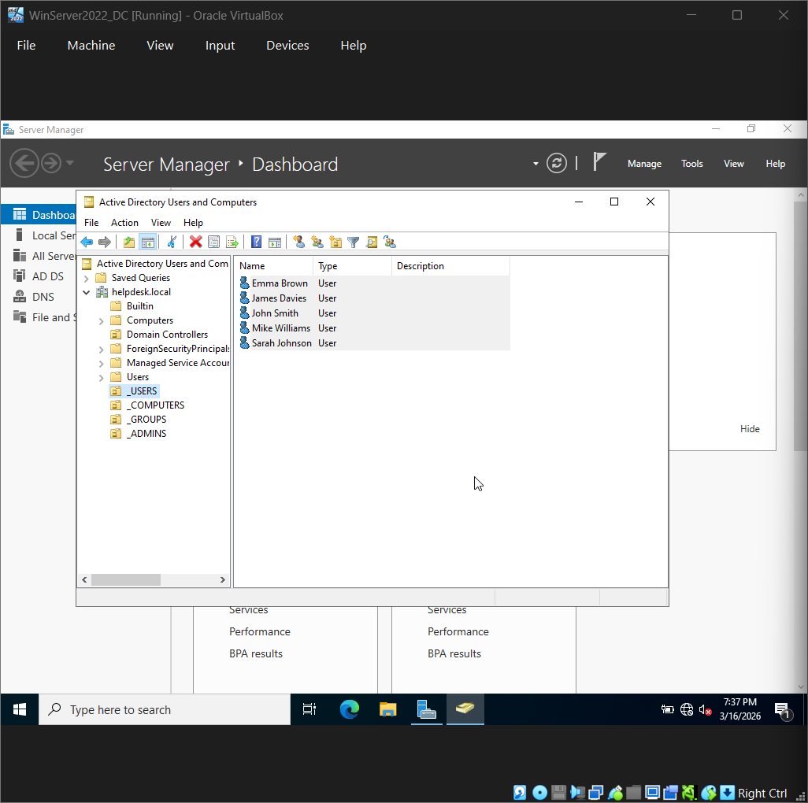
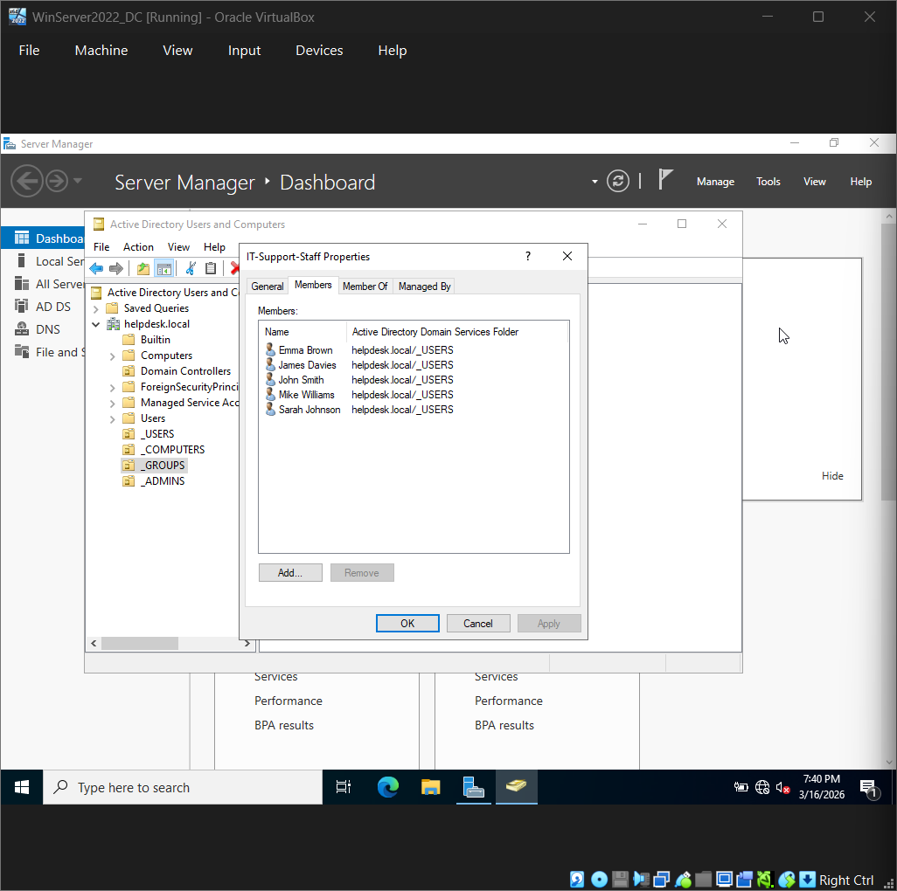
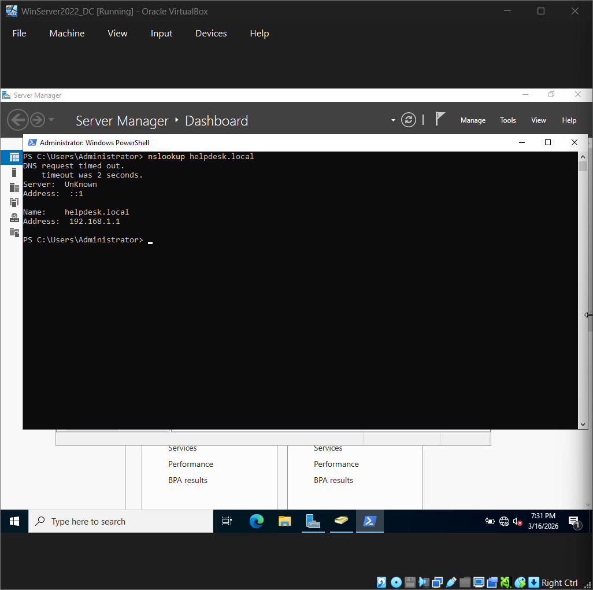
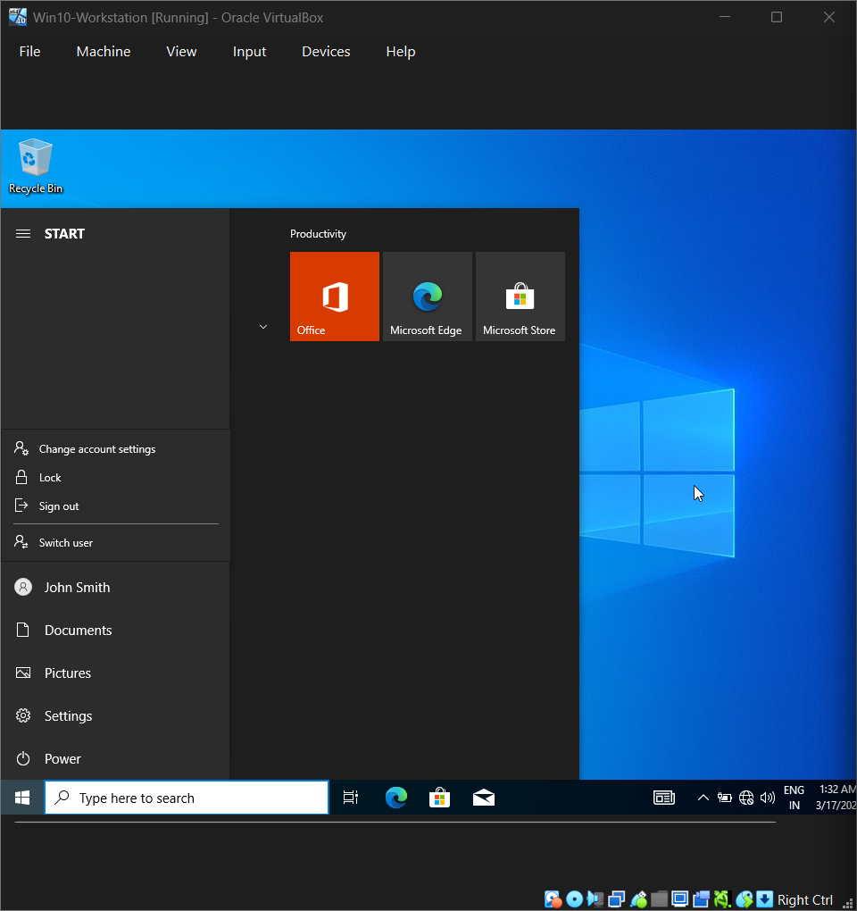
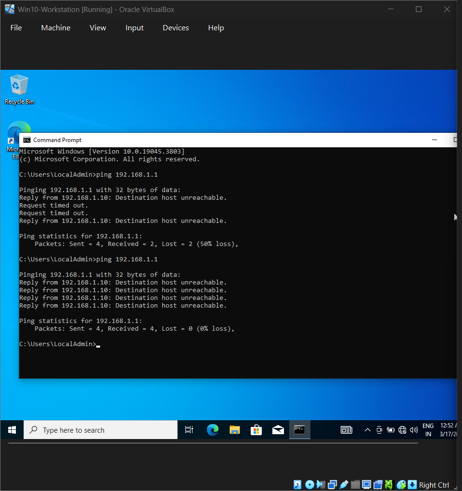
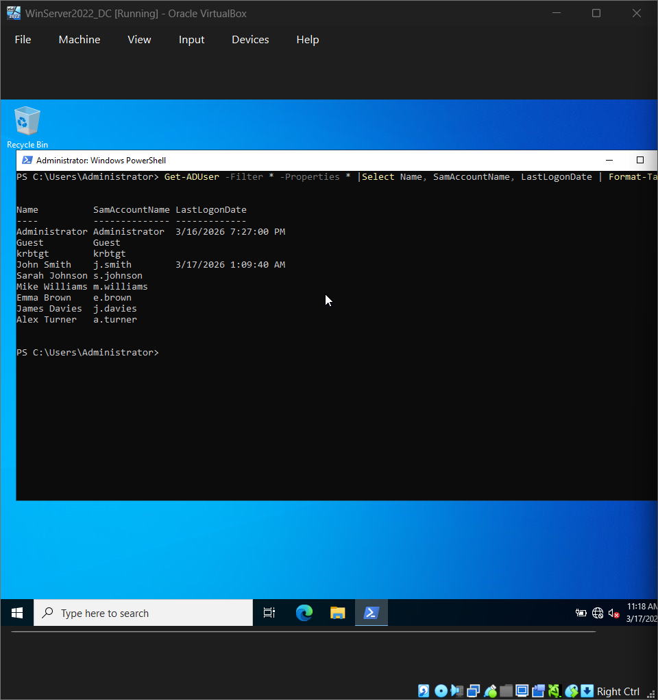
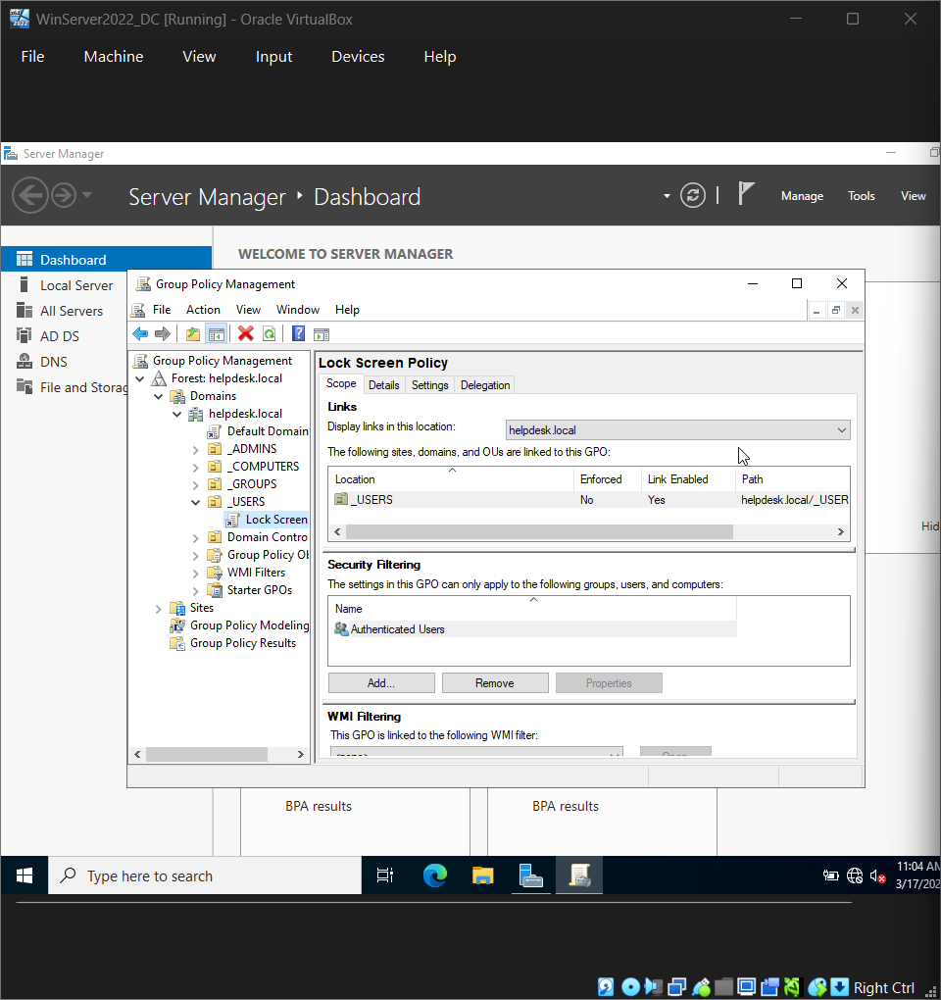

## Skills demonstrated
- Windows Server 2022 administration
- Active Directory configuration and management
- DNS configuration
- Group Policy management
- User account lifecycle management
- Network configuration (static IP, internal networking)
- PowerShell for AD administration
